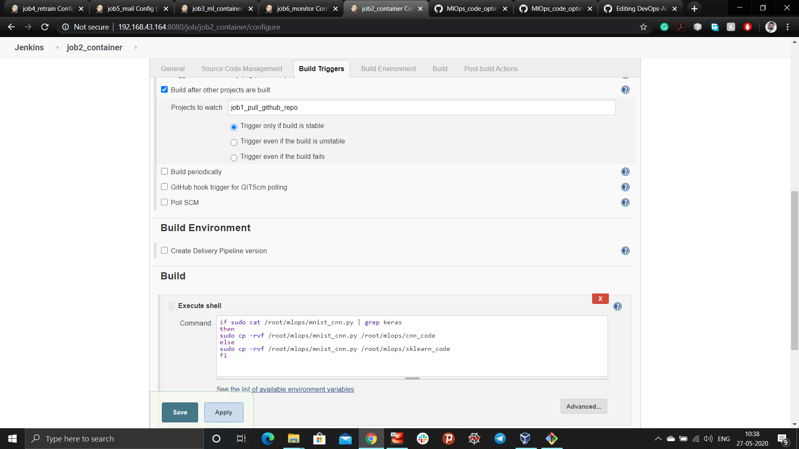

## MlOps: Integration of ML and DevOps
*The model has been created with an ideology to achieve automation. Often, the machine learning model achieves better accuracy with lots of hyper-parameter tuning. But when it comes to the deep neural network, it is really a tedious task to achieve it.*

**Problem statement
```
1. Create container image that’s has Python3 and Keras or numpy  installed  using dockerfile 
2. When we launch this image, it should automatically starts train the model in the container.
3. Create a job chain of job1, job2, job3, job4 and job5 using build pipeline plugin in Jenkins 
4. Job1 : Pull  the Github repo automatically when some developers push repo to Github.
5. Job2 : By looking at the code or program file, Jenkins should automatically start the respective machine learning software installed    interpreter install image container to deploy code  and start training( eg. If code uses CNN, then Jenkins should start the container    that has already installed all the softwares required for the cnn processing).
6. Job3 : Train your model and predict accuracy or metrics.
7. Job4 : if metrics accuracy is less than 80%  , then tweak the machine learning model architecture.
8. Job5: Retrain the model or notify that the best model is being created
9. Create One extra job job6 for monitor : If container where app is running. fails due to any reason then this job should automatically start the container again from where the last trained model left
```
To keep this in mind, I have automated the ml code with the help of docker container and  Jenkins. A separate environment has been built in the docker container with pre-installed required libraries to run the code. First of all, Job of build pipeline will fetch the code from the Github repository. Then, Jenkins will filter the code type i.e. either it is a simple machine learning model or neural network model and as per requirement launch the container. If the model doesn't achieve accuracy up to the mark, a mail will be sent to the developer. And if model crashes, it will automatically trigger the job to build the model again.

Detail setup of the environment:

Create a Dockerfile to setup the container environment
```
FROM centos:latest
RUN yum update -y
RUN yum install python36 -y
RUN yum install python3-pip
RUN pip3 install --upgrade pip
RUN pip3 install tensorflow==2.0.0
RUN pip3 install keras
WORKDIR /model
COPY mnist_cnn.py /model
COPY mnist_sklearn.py /model
COPY mnist_cnn_update.py /model
CMD python3 mnist_cnn.py
```
**Step 1:** Fetching github repository to download the code by triggering it whenever developer commit any changes in the code.

```
sudo cp -rvf * /root/mlops
```
**Step 2:** Copy the code to the specific directory by checking the type of code either it is a simple machine learning model or neural network model.

```
if sudo cat /root/mlops/mnist_cnn.py | grep keras
then
sudo cp -rvf /root/mlops/mnist_cnn.py /root/mlops/cnn_code
else
sudo cp -rvf /root/mlops/mnist_cnn.py /root/mlops/sklearn_code
fi
```
**Step 3.** Launching the container by ckecking the type of code.

```
if sudo cat /root/mlops/mnist_sklearn.py | grep sklearn
then
	if sudo docker ps -a | grep sklearn_container
    then
    sudo docker rm -f sklearn_container
    sudo docker run --name sklearn_container -v /root/mlops/sklearn_code:/model/ sklearn_code:v1
    else
    sudo docker run --name sklearn_container -v /root/mlops/sklearn_code:/model/ sklearn_code:v1
    fi
else
	if sudo docker ps -a | grep keras_container
    then
    sudo docker rm -f keras_container
	sudo docker run --name keras_container -v /root/mlops/cnn_code:/model/ cnn_code:v1
    else
    sudo docker run --name keras_container -v /root/mlops/cnn_code:/model/ cnn_code:v1
    fi
fi
```
